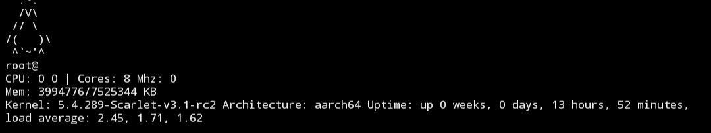

# SmallFetch 
Simple Bash fetch scripts! 
## Screenshot 
 
###### P.S Ignore empty options host issue 
## Usage 
Just run the sh file 
[Download scripts](https://raw.githubusercontent.com/Begitdj/SmallFetch/refs/heads/main/SmallFetch.sh) 
1. Give a run permission chmod +x SmallFetch.sh 
2. Run SmallFetch ./SmallFetch.sh 

